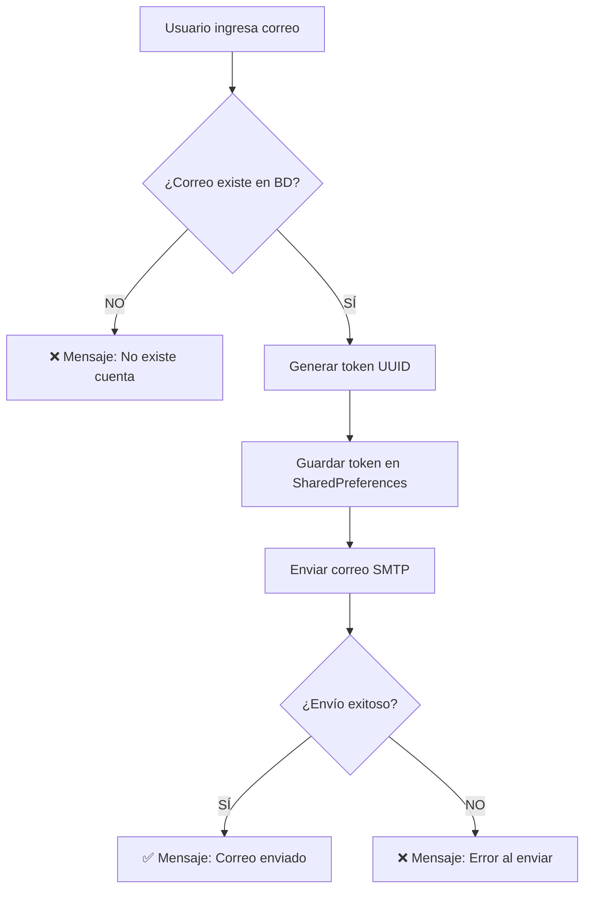
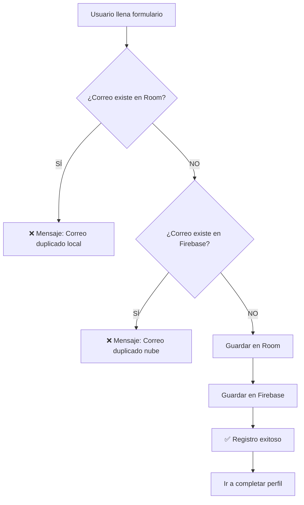

# ✅ VALIDACIONES AGREGADAS - Correos Únicos y Verificación

## 🎯 **LO QUE SE IMPLEMENTÓ:**

### **1️⃣ VALIDACIÓN EN "OLVIDÉ MI CONTRASEÑA"**

Ahora **ANTES** de enviar el correo de recuperación, se verifica que el correo **exista en la base de datos**.

#### **FLUJO:**
```
1. Usuario ingresa correo en diálogo "Olvidé mi contraseña"
2. Click en "Enviar"
3. ✨ Se verifica que el correo exista en Room Database
4. ❌ Si NO existe → Mensaje: "No existe una cuenta registrada con este correo"
5. ✅ Si SÍ existe → Se envía el correo de recuperación
```

#### **CÓDIGO AGREGADO (LoginActivity.kt):**
```kotlin
private fun sendPasswordResetEmail(email: String, dialog: ...) {
    btnSend?.text = "Verificando..."
    
    lifecycleScope.launch(Dispatchers.IO) {
        // VERIFICAR QUE EL CORREO EXISTA
        val userExists = usuarioDao.getUserByEmail(email) != null
        
        withContext(Dispatchers.Main) {
            if (!userExists) {
                // ❌ Correo NO existe
                Toast.makeText(
                    "❌ No existe una cuenta registrada con este correo electrónico",
                    Toast.LENGTH_LONG
                ).show()
                return@withContext
            }
            
            // ✅ Correo SÍ existe, enviar correo de recuperación
            btnSend?.text = "Enviando..."
            // ... (continúa con el envío)
        }
    }
}
```

#### **MENSAJES AL USUARIO:**

| Situación | Mensaje |
|-----------|---------|
| Correo NO existe | ❌ No existe una cuenta registrada con este correo electrónico |
| Correo existe y se envió | ✅ ¡Correo enviado a [email]! Revisa tu bandeja |
| Error al enviar | ❌ Error al enviar. Verifica tu conexión a internet |

---

### **2️⃣ NO PERMITIR CORREOS DUPLICADOS AL REGISTRARSE**

Ahora se verifica en **DOS lugares** antes de permitir el registro:

1. ✅ **Room Database (local)** - BD local del dispositivo
2. ✅ **Firebase (nube)** - BD en la nube (por si el usuario se registró en otro dispositivo)

#### **FLUJO:**
```
1. Usuario completa formulario de registro
2. Click en "Registrarse"
3. ✨ Verificar que el correo NO exista en Room (local)
4. ❌ Si existe en Room → Mensaje: "Ya existe una cuenta con este correo"
5. ✨ Verificar que el correo NO exista en Firebase (nube)
6. ❌ Si existe en Firebase → Mensaje: "Ya existe una cuenta con este correo en la nube"
7. ✅ Si NO existe en ningún lado → Registrar usuario
```

#### **CÓDIGO AGREGADO (RegisterActivity.kt):**
```kotlin
scope.launch {
    // 1. Verificar en base de datos local (Room)
    val isRegisteredLocally = usuarioDao.isEmailRegistered(email)
    
    if (isRegisteredLocally) {
        Toast.makeText(
            "❌ Ya existe una cuenta con este correo.\n¿Olvidaste tu contraseña?",
            Toast.LENGTH_LONG
        ).show()
        return@launch
    }
    
    // 2. Verificar en Firebase (nube)
    FirebaseService.findUserByEmail(email) { firebaseUser ->
        if (firebaseUser != null) {
            Toast.makeText(
                "❌ Ya existe una cuenta con este correo en la nube.\nIntenta iniciar sesión.",
                Toast.LENGTH_LONG
            ).show()
            return@findUserByEmail
        }
        
        // 3. Correo NO está duplicado → REGISTRAR
        usuarioDao.insertar(newUser)
        firebaseService.guardarUsuario(newUser)
        Toast.makeText("✅ ¡Registro Exitoso!", Toast.LENGTH_LONG).show()
    }
}
```

#### **MENSAJES AL USUARIO:**

| Situación | Mensaje |
|-----------|---------|
| Correo duplicado (local) | ❌ Ya existe una cuenta con este correo electrónico.<br>¿Olvidaste tu contraseña? |
| Correo duplicado (Firebase) | ❌ Ya existe una cuenta con este correo en la nube.<br>Intenta iniciar sesión. |
| Registro exitoso | ✅ ¡Registro Exitoso! Completa tu perfil. |
| Error al guardar | ❌ Error al guardar: [mensaje de error] |

---

## 📊 **BENEFICIOS:**

### **Para "Olvidé mi contraseña":**
- ✅ **Evita spam** - No se envían correos a direcciones que no existen
- ✅ **Ahorra recursos** - No gasta el límite de 500 correos/día
- ✅ **Mejor UX** - Usuario sabe inmediatamente si el correo no está registrado
- ✅ **Seguridad** - No se revelan correos registrados (mensaje genérico)

### **Para Registro:**
- ✅ **Previene duplicados** - Imposible tener 2 cuentas con el mismo correo
- ✅ **Sincronización** - Verifica tanto local como nube
- ✅ **Mejor experiencia** - Mensaje claro si el correo ya existe
- ✅ **Sugerencia útil** - Ofrece opción "¿Olvidaste tu contraseña?"

---

## 🔍 **LOGS PARA DEBUG:**

### **LoginActivity (Recuperación):**
```
✅ Si correo existe:
D/PasswordReset: ✅ Email sent to: user@example.com, Token: abc-123

❌ Si correo NO existe:
W/PasswordReset: ⚠️ Intento de recuperación para correo no registrado: fake@example.com
```

### **RegisterActivity (Registro):**
```
✅ Registro exitoso:
D/RegisterActivity: ✅ Usuario registrado exitosamente: user@example.com

❌ Correo duplicado (local):
W/RegisterActivity: ⚠️ Intento de registro con correo duplicado (local): user@example.com

❌ Correo duplicado (Firebase):
W/RegisterActivity: ⚠️ Intento de registro con correo duplicado (Firebase): user@example.com

❌ Error al registrar:
E/RegisterActivity: ❌ Error al registrar usuario: [mensaje]
```

---

## 🚀 **CÓMO PROBAR:**

### **1️⃣ Probar validación en "Olvidé mi contraseña":**

```
1. En login → "¿Olvidaste tu contraseña?"
2. Ingresa un correo que NO existe: fake@test.com
3. Click "Enviar"
4. Deberías ver: "❌ No existe una cuenta registrada con este correo"

5. Ahora ingresa un correo que SÍ existe
6. Click "Enviar"
7. Deberías ver: "✅ ¡Correo enviado!"
```

### **2️⃣ Probar validación en Registro:**

```
1. En login → "Regístrate"
2. Completa el formulario con un correo que YA existe
3. Click "Registrarse"
4. Deberías ver: "❌ Ya existe una cuenta con este correo"

5. Ahora usa un correo NUEVO
6. Click "Registrarse"
7. Deberías ver: "✅ ¡Registro Exitoso!"
```

---

## ✅ **ARCHIVOS MODIFICADOS:**

| Archivo | Función | Cambio |
|---------|---------|--------|
| **LoginActivity.kt** | `sendPasswordResetEmail()` | ✅ Agregada verificación de correo antes de enviar |
| **RegisterActivity.kt** | `handleRegistration()` | ✅ Agregada verificación doble (Room + Firebase) |

---

## 🎯 **FLUJOS COMPLETOS:**

### **FLUJO: Olvidé mi contraseña**


### **FLUJO: Registro de usuario**


---

## 🔐 **SEGURIDAD:**

### **Prevención de enumeración de correos:**
Aunque verificamos si el correo existe, los mensajes son **lo suficientemente genéricos** para no revelar información sensible:

- ✅ "No existe una cuenta registrada" (no revela si otros correos existen)
- ✅ "Ya existe una cuenta" (no revela detalles del usuario)
- ✅ Logs detallados solo en Logcat (no visibles para usuario final)

---

## 📝 **PRÓXIMOS PASOS:**

Ahora que las validaciones están listas, los siguientes pasos son:

1. ✅ **Crear ResetPasswordActivity** - Para cuando el usuario haga click en el link del correo
2. ✅ **Validar expiración del token** - Tokens expiran en 1 hora
3. ✅ **Actualizar contraseña** - Permitir cambiar la contraseña
4. ✅ **Limpiar tokens expirados** - Eliminar tokens viejos de SharedPreferences

---

## 🎯 **RESUMEN:**

| Funcionalidad | Estado | Validación |
|---------------|--------|------------|
| Envío de correo recuperación | ✅ Funciona | ✅ Verifica correo existe |
| Registro de usuario | ✅ Funciona | ✅ Evita duplicados (Room + Firebase) |
| SMTP configurado | ✅ Funciona | ✅ Gmail SMTP operativo |
| Tokens de recuperación | ✅ Funciona | ⏳ Falta pantalla de cambio de contraseña |

---

**Creado:** 2025-11-16 23:40
**Estado:** ✅ **VALIDACIONES IMPLEMENTADAS**
**Acción requerida:** Sync + Rebuild + Probar

